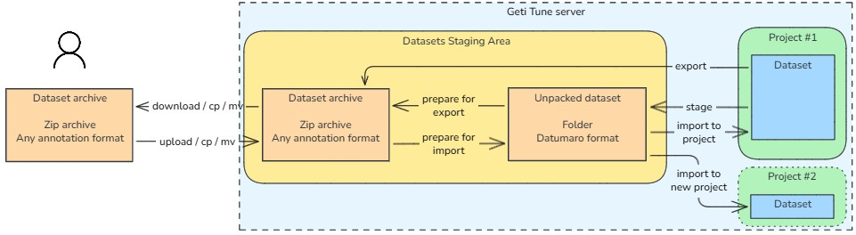
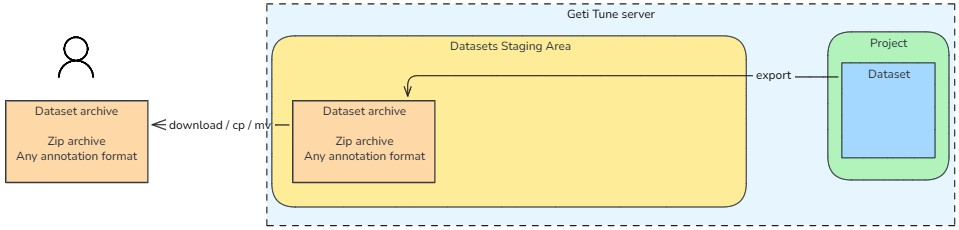
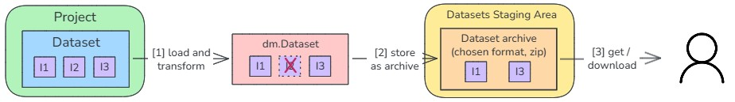
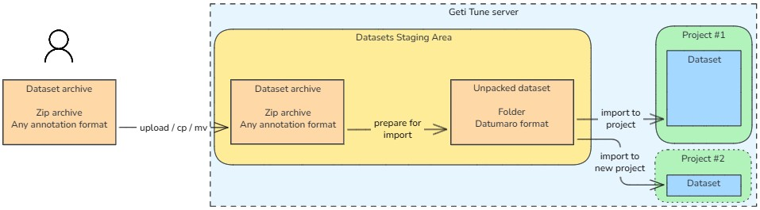
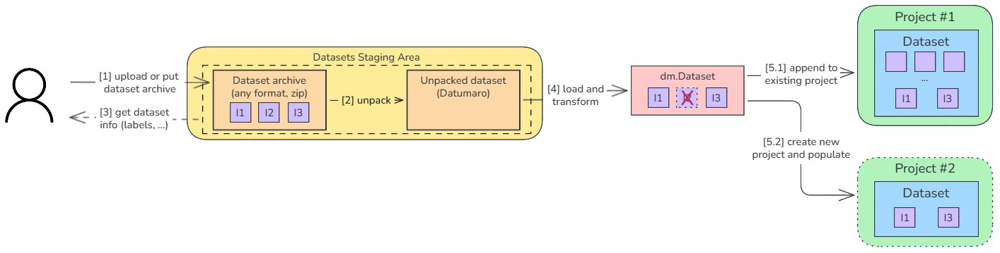
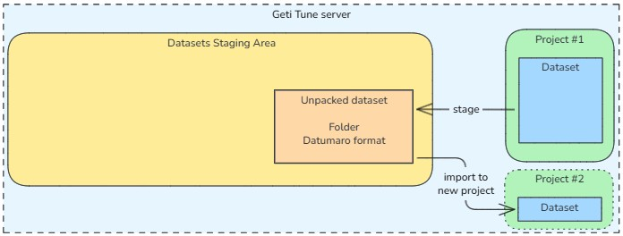
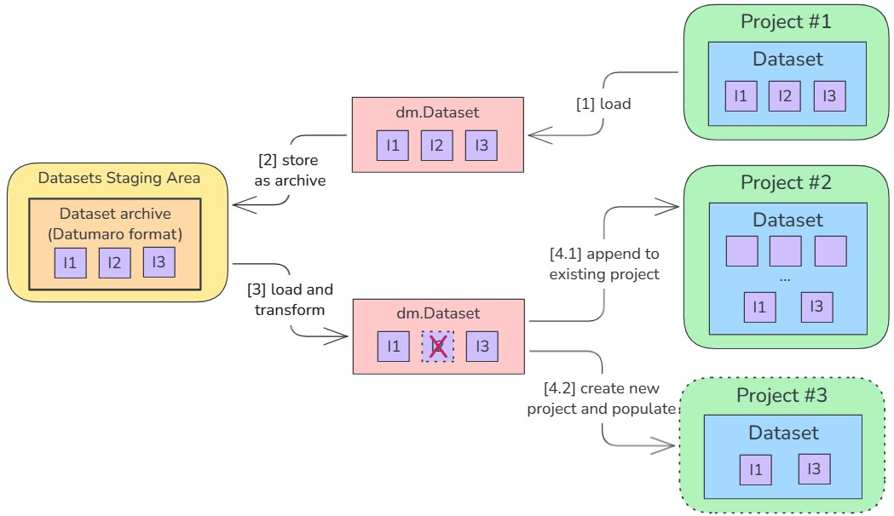

# Dataset import & export

Geti Tune dataset import and export functionality allows users to easily transfer datasets in and out of the platform,
enabling several use cases such as:

1. **Migration to Geti Tune**: Users who have existing datasets, prepared manually or with the help of other tools
   (e.g., Geti, CVAT, Label Studio), can import them into Geti Tune to leverage its training and inference features.
2. **Integration with other tools**: Users can annotate datasets in Geti Tune using its powerful annotation tools,
   export them, and then use them in other machine learning frameworks.
3. **Backup and sharing**: Users can export their datasets for backup purposes or to share them with other people,
   who may not have access to the Geti Tune instance where the dataset was created.
4. **Dataset versioning**: Users can export datasets at different stages of annotation or preprocessing,
   allowing them to maintain versions of their datasets for experimentation and comparison.
5. **Project forking**: Users can export a dataset from one project and import it into another project within Geti Tune,
   potentially with different task type and labels, facilitating the reuse of annotated data across different projects.

## Design

### Goals

Geti's experience shows that users interact with the platform in very different ways, especially when it comes to
ingesting and exporting datasets. Some users prefer to upload/download dataset archives through a web interface,
other prefer to automate the process using APIs or direct file system access.

To accommodate such variety of workflows, the design seeks to break down the aforementioned use cases into a set of
complementary and orthogonal operations. This approach also has the advantage of reducing code duplication, with obvious
benefits in terms of maintainability and reliability.

### Assumptions and Constraints

- Datasets can be arbitrarily large, and most of the operations scale linearly with dataset size.
  - Example of operations: uploading, downloading, archiving, extracting, parsing, transforming.
- Metadata about the dataset (e.g., type of annotations, labels, number of items) can be obtained without fully loading
  the dataset into memory, provided that the dataset is stored in Datumaro format.
- Datasets may be imported to projects of different task types and labels. If so, annotations need to be adapted
  accordingly (see [Task compatibility](#task-compatibility) for more details) and the labels must explicitly re-mapped.

### Overview

The first interesting thing to note is that all use cases involve moving a dataset from a source to a destination.
The source could be an external zip archive, a project's dataset within Geti Tune, or a dataset revision, while
the destination could be a zip file or the dataset of a new or existing project.
Between the source and destination, several intermediate steps may need to take place, depending on the specific use
case: format conversion, compression / decompression, filtering, label remapping.
Through careful interface modeling, it is possible to get all sources to work with all destinations, then realize all
use cases by composing the necessary intermediate steps in a set of endpoints and jobs.

Two important design choices follow from these observations:

1. All datasets that are uploaded or downloaded by the user (directly or via API), must be zip archives in a standard
   dataset format (Datumaro, COCO, ...).
2. Internally, all processing steps must operate on a common representation of the dataset. In practice, this means
   `dm.Dataset` objects from Datumaro.

The first condition provides users with a stable and familiar interface for working with datasets.
The second one avoids coupling the import/export logic to the specifics of any dataset format, making it easier to
add support for new formats in the future; moreover, it allows to take advantage of Datumaro powerful features for
dataset manipulation and filtering.

After defining _how_ datasets should be represented, the next step is to define _where_ the datasets should be stored
during the import/export process. Given the potentially large size of the datasets, it is not feasible to keep them in
memory throughout the entire process; instead, they must be stored on disk, in a location that is accessible to both
the application and the user. To this end, the datasets being imported or exported are temporarily stored in a
_staging area_, that is a dedicated folder in the application storage with a well-defined structure:

```
data/
├─ staged_datasets/
│  ├─ 43134c71-20b7-4504-ad14-207648a1baf9/
│  │  ├─ dataset-coco.zip/
│  ├─ 63f983fe-f2c7-4054-a0b1-6aab8a355a12/
│  │  ├─ dataset/
│  │  │  ├─ data.parquet
│  │  │  ├─ metadata.json
```

In the above example, the staging area contains two datasets being processed, each uniquely identified by a UUID:

- The first one is a zip archive in COCO format. A dataset in this form (compressed) is normally the result of an upload
  operation (for later import) or an export operation (dataset ready for download).
- The second one is a Datumaro dataset in uncompressed form. This form is ideal for internal processing, as
  Datumaro datasets can be efficiently filtered and transformed thanks to its internal polars-based representation.

Notably, the staging area exists purely in the file system; there is no corresponding representation in the database.
This is essential to allow users to access the staging area directly, without going through the application API.
In other words, the users can put datasets directly in the staging area for import operations, or take them directly
from there after an export operation, without needing to go through the API (→ simple and efficient upload / download).

### Data flow

The interactions between the user, the staging area and the application are summarized in the following diagram:



The diagram covers the three main workflows, which are analyzed individually in the next sections:

- [Dataset Export](#dataset-export)
- [Dataset Import](#dataset-import)
- [Dataset Copy / Fork](#dataset-copy--fork)

All long-running operations are executed as background jobs, to avoid blocking the application and to provide
feedback to the user about the operation status (see [Jobs](#jobs) section for more details). All operations can be
initiated through the [REST API](#rest-api).

Filtering and label remapping, when needed, are performed on `dm.Dataset` objects while loading the dataset from
the staging area (import scenarios) or before persisting it to the staging area (export scenarios).

#### Dataset Export





1. Upon user request, the dataset (or dataset revision) to be exported is loaded from the database as a `dm.Dataset`
   object and filtered according to request (e.g., only include images with selected labels). These operations are
   executed in a background job, since they may take a long time depending on dataset size.
2. The filtered dataset is saved to the staging area, in the requested format (e.g. COCO), compressed as a zip archive.
   This step is also part of the background job.
3. The user can download the exported dataset archive through the API, or take it directly from the staging area folder
   if they have read access to the application storage.

#### Dataset Import





1. The user uploads a zip archive containing the dataset to be imported, or they put it directly in the staging area
   folder.
2. The user requests the dataset to be prepared for import, triggering a background job that extracts the archive,
   converts it to Datumaro format and analyzes it to determine its characteristics (task type, labels, number of media
   and annotations).
3. The user is presented with the dataset information, which helps them configure the actual import in the next step.
4. The user triggers the import operation, optionally specifying transformations to be applied to the dataset
   (e.g., label remapping, filtering). The import operation also executes in a background job.
5. The import job finally inserts the dataset items to the chosen destination, which can be an existing (5.1) or new
   (5.2) project's dataset.

#### Dataset Copy / Fork





1. The user selects the dataset (or dataset revision) to use as source for the copy / fork operation.
   A background job loads the dataset and applies any requested filtering.
2. The filtered dataset is saved to the staging area in Datumaro format.
3. The user triggers the import operation, optionally specifying transformations to be applied to the dataset
   (e.g., label remapping, filtering). The import operation also executes in a background job.
4. The import job finally inserts the dataset items to the chosen destination, which can be an existing (4.1) or new
   (4.2) project's dataset.

Filtering can be applied both when staging the dataset (step 1) and when importing it (step 3). Since a staged dataset
can be reused multiple times, applying filtering at staging time can save time and resources when the same
filtering is needed for multiple imports. On the other hand, applying filtering at import time allows more
flexibility, as different filtering criteria can be applied for each import operation.

### Task compatibility

When importing a dataset into an existing project, it is essential to ensure that the dataset's annotations are
compatible with the project's task type and labels. If necessary, annotations must be transformed according to the
following rules:

| Dataset Annotation Type | Project Task Type          | Transformation                                             |
| ----------------------- | -------------------------- | ---------------------------------------------------------- |
| Bounding Box            | Multi-label classification | Collect all the labels of the bounding boxes in the image  |
| Bounding Box            | Instance segmentation      | Reinterpret bounding boxes as polygons                     |
| Polygon                 | Multi-label classification | Collect all the labels of the polygons in the image        |
| Polygon                 | Object detection           | Enclose each polygon in the smallest possible bounding box |

Conversions not listed in the table are not supported and will cause the import operation to fail.

### Concurrency

If the client attempts to launch multiple import/export operations on the same dataset at the same time, there could
be conflicts and race conditions in the staging area. To avoid such issues, the system must implement a locking
mechanism that prevents multiple jobs from accessing the same staged dataset concurrently.

The lock can be implemented using a simple file-based approach: when a job starts processing a staged dataset, it
must acquire a lock by creating a file `{job_id}.lock` in the staged dataset folder. If a `*.lock` file already exists,
then another job is already processing the dataset, and the new job should fail with an appropriate error message.
Once the job completes (successfully or not), it must release the lock by deleting the `{job_id}.lock` file.

### Stage datasets cleanup

Staged datasets can take up significant disk space, which directly depends on the size of the dataset.
It's therefore important to define how and when staged datasets can be removed, otherwise the disk will fill up with
unnecessary files.

A stage dataset can be deleted in two ways:

1. **Manually**: the client can delete a staged dataset through the API when it is no longer needed.
2. **Automatically**: the system can periodically clean up staged datasets that are older than a certain threshold
   (e.g., 24 hours). This can be implemented with a daemon thread that runs at regular intervals (e.g., every hour),
   checking the age of each staged dataset and deleting those that exceed the threshold.

Locked staged datasets (i.e., those currently being processed by a job) must not be deleted.

## Jobs

The design relies heavily on background jobs to perform long-running operations. This section describes the main jobs
involved in dataset import and export.

- **prepare_dataset_for_import**: extracts a compressed dataset archive, saving it to Datumaro format while determining
  its characteristics (task type, labels, number of media and annotations).
- **import_dataset_to_existing_project**: loads a Datumaro dataset and inserts its items into the dataset of a project,
  applying optional filtering, annotation conversion and label remapping.
  If the target is a new project, this job also creates the project.
- **import_dataset_as_new_project**: creates a new project, then loads a Datumaro dataset and inserts its items into
  the dataset of the newly created project, applying optional filtering and annotation conversion.
- **stage_dataset**: loads a project's dataset (or dataset revision) as a Datumaro dataset, applying optional filtering,
  then saves it to the staging area in Datumaro native format.
- **export_dataset**: loads a project's dataset (or dataset revision) as a Datumaro dataset, applying optional
  filtering, then saves it to the staging area in the requested format (e.g., COCO) as a compressed zip archive.

> [!NOTE]
> The diagram in the [Data flow](#data-flow) section also shows an operation **prepare-for-export**, to create
> a zip archive out of a persisted Datumaro dataset. It is shown for completeness, however it is not necessary to
> implement it in practice since the _export_ operation already combines **stage** and **prepare-for-export**.\_

[](ignored)

> [!NOTE]
> The operation **stage** is also technically redundant, as it could be expressed as an **export** operation followed
> by a **prepare-for-import**. Nevertheless, it still makes sense to implement it, to avoid an unnecessary compression /
> decompression cycle when copying the dataset internally from one project to another.

## REST API

> [!WARNING]
> The API described below is only for design purposes and it may not reflect the actual implementation.
> Please refer to the OpenAPI specification for the definitive reference.

### Staging Area Management

#### Upload archive to staging area

_Endpoint:_ `POST /api/staged_datasets`

_Response:_ HTTP 201 Created

```json
{
  "id": "43134c71-20b7-4504-ad14-207648a1baf9",
  "format": "coco",
  "compressed": true,
  "ready_for_export": false,
  "ready_for_import": false,
  "size_bytes": 123456789
}
```

> [!NOTE]
> For large datasets, a simple file upload endpoint may not be ideal in case of unreliable network connections.
> Normally, a more robust upload mechanism would leverage resumable uploads (tus); in this case, for simplicity,
> the recommended approach is to upload the dataset archive directly to the staging area folder, bypassing the API.

---

#### Download archive from staging area

_Endpoint:_ `GET /api/staged_datasets/{staged_dataset_id}/zip`

_Response:_ HTTP 200 OK and zip file content

---

#### List staged datasets

_Endpoint:_ `GET /api/staged_datasets`

_Response:_ success -> JSON list of staged datasets

```json
[
  {
    "id": "43134c71-20b7-4504-ad14-207648a1baf9",
    "format": "coco",
    "compressed": true,
    "ready_for_export": true,
    "ready_for_import": false,
    "size_bytes": 123456789
  },
  {
    "id": "63f983fe-f2c7-4054-a0b1-6aab8a355a12",
    "format": "datumaro",
    "compressed": false,
    "ready_for_export": false,
    "ready_for_import": true,
    "size_bytes": 987654321,
    "metadata": {
      "num_items": 2000,
      "annotation_type": "bounding_box",
      "num_annotations": 10000,
      "labels": ["person", "bicycle", "tree"]
    }
  }
]
```

The `metadata` field is only returned for staged datasets in uncompressed Datumaro format (ready for import).

---

#### Delete staged dataset

_Endpoint:_ `DELETE /api/staged_datasets/{staged_dataset_id}`

_Response:_ HTTP 204 No Content

---

### Export Operations (to staging area)

#### Export (as archive, ready for download)

_Endpoint:_ `POST /api/jobs`

_Body_:

```json
{
  "job_type": "export_dataset",
  "project_id": "103b9b76-ada6-4381-91bf-fa315fe5cb66",
  "dataset_revision_id": "be9f47fc-c741-457b-9c97-f60b9485821b",
  "parameters": {
    "export_format": "coco",
    "filters": {
      "labels": ["person", "car"],
      "subset": "train",
      "include_unannotated": false
    }
  }
}
```

- Dataset revision is optional; if not provided, the project's dataset is used.
- `export_format` can be any of the supported formats (e.g., `coco`, `yolo`, `datumaro`, ...)
- `filters` are optional; if not provided, the entire dataset is exported.

_Response:_ HTTP 201 Created

```json
{
    "job_id": "d290f1ee-6c54-4b01-90e6-d701748f0851",
    ... other job fields ...
}
```

---

#### Stage dataset (as Datumaro dataset, ready for import)

_Endpoint:_ `POST /api/jobs`

_Body_:

```json
{
  "job_type": "stage_dataset",
  "project_id": "103b9b76-ada6-4381-91bf-fa315fe5cb66",
  "dataset_revision_id": "be9f47fc-c741-457b-9c97-f60b9485821b",
  "parameters": {
    "filters": {
      "labels": ["person", "car"],
      "subset": "train",
      "include_unannotated": false
    }
  }
}
```

_Response:_ HTTP 201 Created

```json
{
    "job_id": "d290f1ee-6c54-4b01-90e6-d701748f0851",
    ... other job fields ...
}
```

---

### Import Operations (from staging area)

#### Prepare for import

_Endpoint:_ `POST /api/jobs`

_Body_:

```json
{
  "job_type": "prepare_dataset_for_import",
  "staged_dataset_id": "63f983fe-f2c7-4054-a0b1-6aab8a355a12"
}
```

_Response:_ HTTP 201 Created

```json
{
    "job_id": "d290f1ee-6c54-4b01-90e6-d701748f0851",
    ... other job fields ...
}
```

---

#### Import to existing project

_Endpoint:_ `POST /api/jobs`

_Body_:

```json
{
  "job_type": "import_dataset_to_project",
  "staged_dataset_id": "63f983fe-f2c7-4054-a0b1-6aab8a355a12",
  "project_id": "103b9b76-ada6-4381-91bf-fa315fe5cb66",
  "parameters": {
    "filters": {
      "labels": ["person", "car", "motorcycle"],
      "subsets": ["training", "validation"],
      "include_unannotated": false
    },
    "labels_mapping": {
      "car": "vehicle",
      "motorcycle": "vehicle",
      "person": "person"
    },
    "subset_mapping": {
      "train": "training",
      "validation": "validation",
      "unassigned": "testing"
    }
  }
}
```

- `filters.labels` determines which labels to consider among those present in the staged dataset. If omitted, all
  labels are considered.
- `filters.subsets` optionally selects which subsets of the dataset to consider. If omitted, all subsets are considered.
- `filters.include_unannotated` determines whether to include media items without annotations. Default is `true`.
- `labels_mapping` determines how to map labels from the staged dataset to the target project's labels. If omitted,
  labels are assumed to exactly match by name; if any label does not match, the job will fail.
- `subset_mapping` determines how to map subsets from the staged dataset to the target project's subsets.
  If omitted, subsets are not remapped.

_Response:_ HTTP 201 Created

```json
{
    "job_id": "d290f1ee-6c54-4b01-90e6-d701748f0851",
    ... other job fields ...
}
```

---

#### Import to new project

_Endpoint:_ `POST /api/jobs`

_Body_:

```json
{
  "job_type": "import_dataset_as_new_project",
  "staged_dataset_id": "63f983fe-f2c7-4054-a0b1-6aab8a355a12",
  "parameters": {
    "project": {
      "name": "New Project from Imported Dataset",
      "task_type": "object_detection",
      "labels": ["person", "vehicle"]
    },
    "filters": {
      "labels": ["person", "car", "motorcycle"],
      "subsets": ["train", "validation"],
      "include_unannotated": false
    }
  }
}
```

_Response:_ HTTP 201 Created

```json
{
    "job_id": "d290f1ee-6c54-4b01-90e6-d701748f0851",
    ... other job fields ...
}
```
