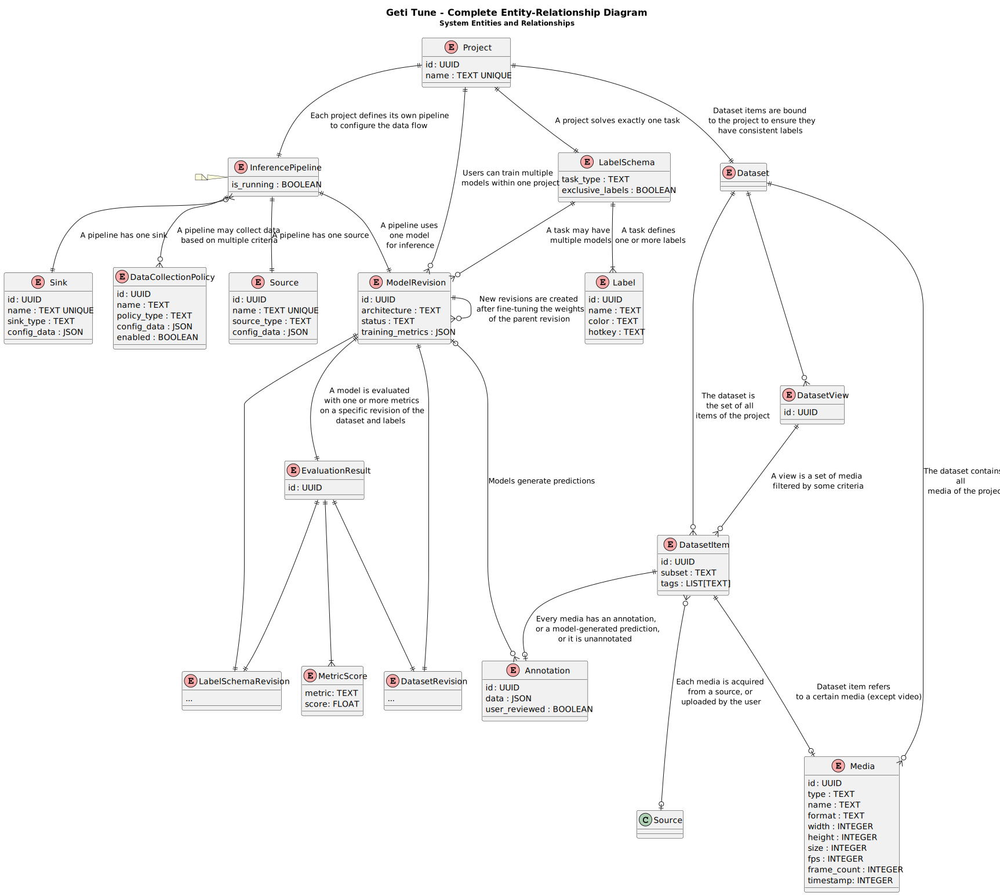

# Geti Tune entities

In Geti Tune, a _project_ (`Project`) represents the machine learning problem that the user wants to solve,
and at the same time serves as a container for all the assets related to it (datasets, models, ...)

The definition of the problem consists of a _task_ and a set of _labels_ (`Label`).
The `LabelSchema` entity encapsulates the information about the task type, the labels and their relationships.
An example of a task is "object detection" with labels "car", "person" and "bicycle".

Each project has an `InferencePipeline`, that is a sequence of processing steps that acquires a stream of
data from a _source_ (`Source`), runs inference using a _model_ (`ModelRevision`) like YOLO, processes the results
and eventually sends them to a _sink_ (`Sink`). Examples of sources are video files or IP cameras, while examples of
sinks are folders on the local filesystem or messaging frameworks like MQTT or ROS2.
After inference, the frames and their predictions are analyzed to identify potential anomalies or out-of-distribution
samples (_model monitoring_), and these may be collected based on one or more policies (`DataCollectionPolicy`).

The collected frames are stored in a _dataset_ (`Dataset`) as _media_ (`Media`), so that the user can
examine them and eventually use them, for example, to make the model more robust via fine-tuning.
It is also possible for the user to manually upload images or videos to a dataset, and annotate them using the built-in
annotation tool. User cannot annotate whole video, but can annotate certain frames.
A dataset is therefore a collection of image-like or video items (`Media`), each of which may have
some _annotation_ data (`Annotation`) via _dataset_item_ (`DatasetItem`) that is either a _user annotation_ or a _model prediction_.

In addition to annotations, which are used when training and evaluating models, it is also possible to assign
custom _tags_ to each dataset item. A tag is a simple label that has no effect on model training or evaluation, but can be
used to organize and filter the dataset items. Filtered data, based on tags and/or other properties (e.g. timestamp),
can be used to create a _view_ in the dataset (`DatasetView`). A dataset view basically represents a subset of the
dataset items; the user fully controls which items belong to a view.

When the user decides to train a new model - optionally fine-tuning a previous model - Geti Tune creates a snapshot
of the dataset, namely a _dataset revision_ (`DatasetRevision`), that captures the exact state of the dataset when
that model is trained. A dataset revision is therefore an immutable entity, and is not affected by subsequent changes
to the main dataset, for example when images are added or removed. In other words, it is always possible to access the
exact data used to train a specific model, even if an image has been deleted or the annotations have been modified.

A _model revision_ (`ModelRevision`) is a model instance obtained by fine-tuning the weights of another model revision,
or a set of publicly available pre-trained weights. For each model, it is important to store not only the training
dataset revision, but also the exact label schema used to train it (`LabelSchemaRevision`). This is because the user
may later choose to add, remove or rename labels, while the structure of the model output is fixed at training time.

As regards the evaluation of the performance of a model, the `EvaluationResult` keeps track of the results obtained
by a model revision when evaluated on a specific dataset revision, or a subset of it. The evaluation may consider
multiple _metrics_, depending on the task type (e.g. accuracy, mAP, ...), and the respective scores are stored in a
`MetricScore` value object.
