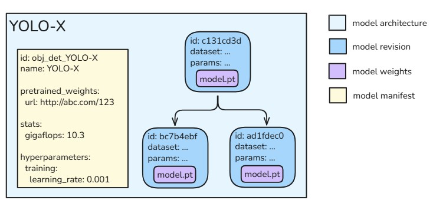
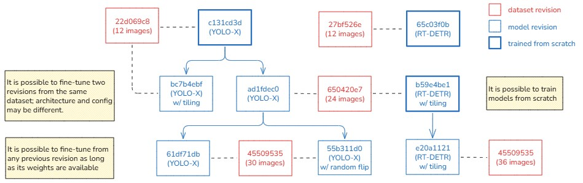
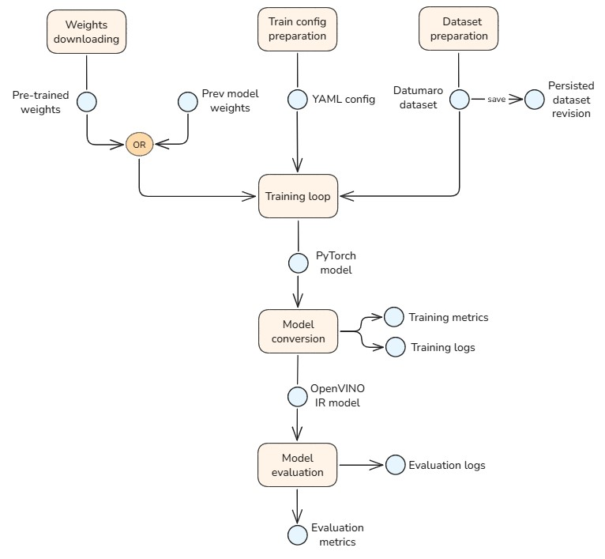

# Model management

Models are the core component of the [inference pipeline](pipeline.md) in Geti Tune, responsible for generating
predictions on the input data. This document explains how models are created, managed and used in Geti Tune workflows.

## Core concepts

In Geti Tune, several key concepts are used to describe and manage models:

- **Model architecture**: The design and structure of a neural network, such as YOLO, ResNet, or EfficientNet.
  The architecture defines the layers, connections, and computational graph, but does not include any learned parameters.

- **Model revision**: A specific instance of a model architecture that has been fine-tuned on a particular dataset
  with a specific configuration. Each model revision corresponds to a set of weights and training artifacts, along with
  metadata about the training process. Model revisions are versioned, allowing users to track the evolution of models.

- **Model weights**: The learned parameters of a neural network, obtained through training.
  Weights determine how the model processes input data and generates predictions.

- **Model manifests**: A set of YAML files that describe the available model architectures, their capabilities,
  configurable parameters and other properties such as the URL to download the pre-trained weights.
  Model manifests are used internally by the app to populate the list of architectures available for training.

> [!NOTE]
> The term "model" alone can be ambiguous. Unless otherwise specified, in this document "model" always refers to a
> model revision — a trained, versioned instance of a model architecture ready for deployment in the inference pipeline.



## Model lifecycle

The lifecycle of a model revision in Geti Tune consists of several key stages:

1. **Task selection during project creation**: When creating a project, the user selects the machine learning task
   (e.g., classification, object detection, semantic segmentation). This determines the type of model architectures
   available for the project.

2. **Selection of architecture, training configuration, and base model**: Before training, the user chooses a suitable
   model architecture (such as YOLO, EfficientNet) and configures training parameters (e.g., learning rate, augmentations).
   The user also selects a base model for fine-tuning, which can be a public pre-trained model or an existing model
   revision from the same project.

3. **Training**: The selected model is fine-tuned using OTX (OpenVINO Training Extensions), the open-source framework
   which implements the actual model and relative training pipeline in PyTorch. During training, the model learns from
   the dataset annotations to predict the specific classes of the project. The training process produces a bunch of
   artifacts, including the trained weights, logs, and metrics.

4. **Model conversion**: After training, the model weights are converted from PyTorch format to OpenVINO Intermediate
   Representation (IR) format, for efficient inference on Intel hardware.

5. **Evaluation**: The converted model is evaluated on validation data to assess its accuracy and performance.
   Evaluation results help determine whether the model is ready for deployment or requires further fine-tuning.

6. **Enablement in the inference pipeline**: Once validated, the model revision can be manually enabled in the project's
   inference pipeline. The selected model is then used to generate real-time predictions on the incoming data stream.

7. **Model or weight removal**: Eventually, after the model is no longer needed or a more recent and accurate revision
   becomes available, the user may decide to delete the model revision or just its weights to free up storage space.
   Deleted models are no longer available for inference or further training.

## Model versioning

When users want to create a new model revision, they can choose any architecture compatible with the task, as well as
the base model to fine-tune from. Such weights can be either from a public pre-trained model or from an existing
model revision in the same project. In the latter case, a parent-child relationship is established between the two
model revisions; these links form a versioning chain that allows users to track the evolution of models over time.
Revisions trained from scratch, namely from the pre-trained weights, do not have a parent model. A model revision may
be used as a base for multiple new model revisions, allowing users to experiment with different training configurations.

Since the dataset can evolve over time as new annotations are added or existing ones modified, each model revision
is tied to a [dataset revision](dataset.md#dataset-revisions), that is an immutable snapshot of the dataset at the
time of training. Different model revisions usually correspond to different dataset revisions, but it is possible
to train multiple model revisions on the same dataset revision (e.g., to compare different architectures or training
settings on the same data).



## Storage

### Database

The metadata of each model revision is stored in the database in a table called `model_revisions`. It includes:

- Unique identifier of the model revision
- Identifier of the project
- Architecture type
- Training status and start/end timestamps
- Labels (classes) the model was trained on
- Dataset revision used for training
- Parent model revision (if any)
- Status of the binary weights (available or deleted)

Models are referenced by id in other tables too:

- `pipelines` to indicate which model is currently enabled for inference
- `evaluations` to store evaluation results for each model

### Objects

Weights and artifacts relative to each model revision are stored as files in the filesystem, and organized as follows:

```
BASE_DATA_DIR/
├─ projects/
│  ├─ 0cd6adee-8887-45d9-ae46-b90a214bb1ea/
│  │  ├─ models/
│  │  │  ├─ 6b7bb928-5d6f-46ea-8fd2-5ce80dd1e12b/
│  │  │  │  ├─ model.pt                # PyTorch weights after training
│  │  │  │  ├─ model.xml               # OpenVINO IR model (XML), converted from model.pt
│  │  │  │  ├─ model.bin               # OpenVINO IR weights (BIN)
│  │  │  │  ├─ training_metrics.json   # Training metrics logged during training (e.g. accuracy, loss)
│  │  │  │  ├─ training.log            # Training log file
```

Since model revisions can be large, users may choose to delete the weights of a model revision when no longer needed,
freeing up disk space while retaining the metadata in the database for tracking purposes.

The filesystem is also used to cache the pre-trained weights. When training a model architecture for the first time,
the server downloads on the fly the corresponding base weights, if not already available locally, fetching them from
a public internet archive. In case of offline deployment (no internet connection), the admin must manually upload the
weights into the data folder, at least for the models he intends to train.

The weights are grouped by task type and architecture, as shown below:

```
BASE_DATA_DIR/
├─ pretrained_weights/
│  ├─ classification/
│  ├─ detection/
│  │  ├─ Custom_Object_Detection_YOLOX/
|  │  │  ├─ weights.pt
│  │  ├─ Object_Detection_RTDetr_101/
│  │  │  ├─ weights.pt
│  ├─ instance_segmentation/
```

The URL where to download the weights of a given architecture is specified in the respective model manifest.
The manifest themselves are stored in the filesystem too, under the `model_manifests` folder, and grouped by task type:

```
BASE_DATA_DIR/
├─ model_manifests/
│  ├─ classification/
│  │  ├─ efficientnet_b0.yaml
│  ├─ detection/
│  │  ├─ yolox_s.yaml
│  │  ├─ rtdetr_101.yaml
│  ├─ instance_segmentation/
│  │  ├─ mask_rcnn_r50_v1.yaml
```

## Training and evaluation

Training a model is a complex, multi-step process, and as such, it is represented by a job in Geti Tune.
A job is an instance of a structured workflow that performs a specific function (in this case, training a model).
It runs in the background when resources are available, and eventually finishes after a potentially long but
finite amount of time; for details about how jobs are scheduled and executed, see [Jobs](jobs.md).

The first step of the training job is the preparation of the dataset. In fact, the dataset items as well as their
annotations already exist within the database, but in a layout designed for transactional workloads, like an API
that returns or modifies individual items. On the other hand, training needs to read items in batches and repeatedly
(every epoch), so the dataset must be converted into a format optimized for this kind of access pattern.
For this purpose, the training job creates a [Datumaro](https://github.com/open-edge-platform/datumaro) `Dataset` and
populates it with the samples from the database.
During the conversion, a subset is assigned to any item that doesn't already have one; the assignment is based on
stratified sampling, and each item's subset remains unchanged in subsequent training rounds to avoid subset leakage.

The actual training loop is controlled by the OTX `Engine`, configured with an `OTXDataModule` that is initialized
from the previously created `Dataset`. Just before the loop starts, the hyperparameters are serialized to a YAML file
in OTX-compatible format, and any necessary base weights are downloaded if not already cached locally.
Training is a lengthy process that involves multiple epochs of forward and backward passes, optimization steps,
and periodic evaluation on the validation set. All these operations are handled internally by OTX, which works
seamlessly with different devices including CPU and GPUs (Intel and Nvidia).
Throughout the training, various metrics (e.g. accuracy and loss) are logged to a JSON file for later analysis.
After training, the resulting PyTorch weights are converted to OpenVINO IR format using the
[OpenVINO model converter](https://docs.openvino.ai/2024/notebooks/convert-to-openvino-with-output.html).
Finally, the training job updates the model revision record in the database with the training status, timestamps,
and other relevant metadata.

The final step is the evaluation of the trained model on the testing subset, with all the metrics supported by the
specific task (e.g. mAP for object detection, see [Evaluation Metrics](#evaluation-metrics) for the complete list).
The results are stored in the `evaluations` table in the database, linked to the corresponding model revision.
The metrics help users assess the model's performance and decide whether to enable it in the inference
pipeline. Implementation-wise, the evaluation step relies on ModelAPI to generate the predictions which are then
compared to the ground truth annotations to compute the metrics.



> [!NOTE]
> For training purposes, the Datumaro `Dataset` can be kept in-memory and consumed as is by OTX.
> However, persisting it to disk is still necessary if, at a later time, the user wants to re-train another model
> on the same dataset revision, or to simply inspect the dataset contents. For this reason, it is recommended to
> store the dataset in a format like Parquet that allows efficient loading and querying, with or without Datumaro.

### Evaluation metrics

The following table lists the evaluation metrics supported by Geti Tune for each task type.
Most of the metrics commonly used in research and industry are included.

| Task Type                 | Metrics                                                   |
| ------------------------- | --------------------------------------------------------- |
| Multiclass Classification | Accuracy, Precision, Recall, F1                           |
| Multilabel Classification | Subset Accuracy, Hamming Loss, Precision, Recall, F1, mAP |
| Object Detection          | mAP@0.5-0.95 (and single mAP at the various thresholds)   |
| Instance Segmentation     | mAP@0.5-0.95 (and single mAP at the various thresholds)   |

## Model deletion

Model artifacts, especially the weights, can consume a significant amount of disk space.
To manage storage effectively, Geti Tune allows users to delete model revisions or just their weights when they
are no longer needed. Deleting a model revision removes its metadata from the database and all associated files
from the filesystem, while deleting just the weights retains the metadata for tracking purposes but frees up
the disk space used by the weight files.
After removing the weights, it is no longer possible to use the model for inference or as a base for further training.
In any case, the deletion of a model has no impact on the other models in the project, even if they were fine-tuned
from the deleted model (in this case, the parent link is deleted too).

## API

See the [API reference](api.md#models).
