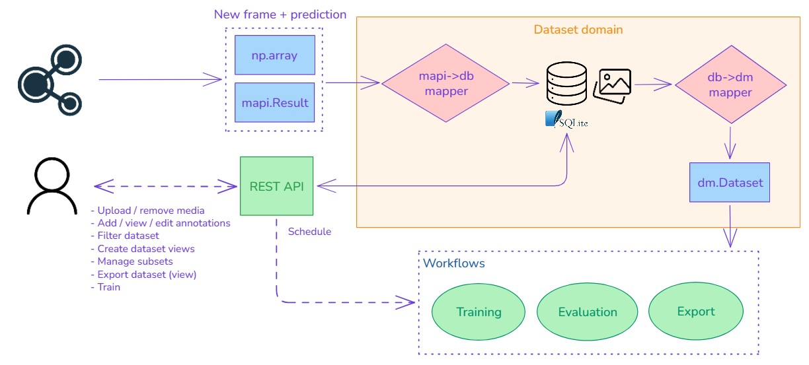

# Dataset management

Geti Tune can acquire new data directly from a source (e.g., a camera) and populate a dataset with predictions 
generated by a model. At the same time, the user can also interact with the datasets, manually adding new media items
or editing annotations.

A dataset is a collection of media items (images) and their annotations/predictions, which serves as a unit for
analytical workflows (training, evaluation, data exploration, ...) and other batch operations (conversion, export, ...). 
In Geti Tune, the same media may be assigned to multiple datasets: this is a simple yet powerful property, 
that gives the user a lot of flexibility in choosing which subset of the data to use for a given workflow.



The above diagram shows how datasets are stored and managed in Geti Tune.  
The core class to represent an individual item in a dataset is `DatasetItem` from the `datumaro` package
([source](https://github.com/open-edge-platform/datumaro/blob/9bb43509382c5a7e2c50de09d8519dd9b8b1bf2e/src/datumaro/components/dataset_base.py#L23)).
This class contains a reference to a media and its annotation or prediction, plus optional attributes that
may be used to store arbitrary metadata or information about the subset assignment of the item.
The choice of `DatasetItem` as main data structure is motivated by two factors:
- Datumaro is the reference library for managing datasets in the training backend and the other Geti projects.
By adopting the same structures, integration is simpler and avoids unnecessary conversions.
- Datumaro allows to export datasets in a variety of formats, which is useful for interoperability with other tools.

The information about the images, their annotations and the datasets they are assigned to is stored in a database,
while the actual media files are stored in the filesystem.

## Storage

### DB schema


The database saves the relevant information in the following tables:
- `media`: contains the metadata of each media item, such as the format (e.g. JPG), size (in bytes) and shape. Each
media is identified by a unique id, and the actual media file is stored in the filesystem with a name that matches
the id and the format (e.g. `e4531145-540f-4a0b-8e70-02a70aef9637.jpg`). Media uploaded by the user may also keep their
original filename (not guaranteed to be unique) to help the user recognize the media in the UI, even though the primary
identifier for all operations remains the uuid. The records also contain an optional reference to the source that
generated the media (e.g. a camera), which is useful for traceability; the field can be null if the media was uploaded
manually, or if the source has been deleted.
- `annotations`: contains the annotation info for the media items that have been annotated by the user or have a
prediction generated by a model. The annotation data (shapes and labels) is stored as JSON in the `data`
field (more details [here](#annotations-as-json); the schema of the JSON depends on the type of annotation
(e.g. bounding boxes, polygons, etc.).
The distinction between annotations and predictions is determined by the fields `from_model` and `user_reviewed`
(more details [here](#annotations-vs-predictions))).
- `datasets`: contains the metadata of each dataset, such as the name. Each dataset is identified by a unique id.
- `dataset_media`: a many-to-many relationship table that associates media items with datasets. Each record contains
the id of the media item and the id of the dataset it belongs to, and optionally information about the subset if that
dataset is used for training, validation or testing.

### Details

#### Annotations schema

The schema of the `annotations.data` field is flexible and can represent different types of annotations.
It is a JSON list of objects, where each object represents a single annotation or prediction and it consists of a
shape and one or more labels. The shape defines the geometry of the annotation, while the labels provide additional
information about the object(s) in the image, such as their class or confidence score. The shape schema depends on the
type of annotation, while the labels schema is consistent across all types.

```json
[
  {
    "labels": [{"id": "d476573e-d43c-42a6-9327-199a9aa75c33", "confidence": 0.7}], 
    "shape": <shape_1>
  },
  {
    "labels": [{"id": "d622bfdd-83a9-49c6-9f8d-e58019b2f553", "confidence": 0.9}],
    "shape": <shape_2>
  }
]
```

**Classification**

For classification tasks, the shape is a full image, meaning that the annotation applies to the whole image.
```json
{"shape": {"type": "full_image"}}
```

**Detection**

For detection tasks, the shape is a bounding box defined by its top-left corner coordinates, width and height.
All coordinates are absolute, integer, and must be within the image bounds.
```json
{"shape": {"type": "rectangle", "x": 10, "y": 20, "width": 100, "height": 200}}
```

**Segmentation**

For segmentation tasks, the shape is a polygon defined by a list of points (x, y) that form the vertices of the polygon.
The points are absolute, integer, and must be within the image bounds. The polygon can be concave or convex but must
not be self-intersecting. The points are ordered in a counter-clockwise manner.

```json
{"shape": {"type": "polygon", "points": [[10, 20], [20, 60], [30, 40]]}}
```

#### Annotations as JSON

The choice of storing annotations as JSON is motivated by the need to support different types of annotations while
keeping the database schema simple and flexible. Moreover, the same JSON representation is also used by the REST API,
effectively making it easy and fast to access annotations via API. The downside is that advanced dataset filter queries
based on the annotation properties (e.g. min annotation size) are more difficult to implement directly in the database,
even though it is still possible thanks to SQLite JSON functions like `json_extract()`.

#### Annotations vs predictions

The fields `from_model` and `user_reviewed` together define the source of the annotation and its status:
- `from_model` is a UUID that identifies the model that generated the prediction. If the annotation was created
manually by the user, this field is null. When the user accepts a prediction _without making changes_, the value of this
field is kept unchanged, else it is reset to null.
- `user_reviewed` is a boolean that indicates whether the user has confirmed the correctness of the annotation,
explicitly (by accepting a prediction) or implicitly (when creating or editing the annotation).

The following table summarizes the possible combinations of these two fields and their meaning:

| `from_model` | `user_reviewed` | meaning                                                                |
|--------------|-----------------|------------------------------------------------------------------------|
| <model_id>   | false           | Prediction not reviewed yet                                            |
| <model_id>   | true            | Prediction reviewed and accepted as it is                              |
| null         | false           | Not possible                                                           |
| null         | true            | Annotation created by the user, from scratch or modifying a prediction |

## Data flow

The inference stage of the pipeline, followed by the dataset collection module, streams newly acquired media items
(images represented as `np.array`) along with their predictions (a subclass of `model_api.Result`) and other metadata. 

Before it can be stored in the database and optionally associated with one or more datasets, the media item and its
predictions must be first converted into a `dm.DatasetItem` object. This transformation is performed by the
`DatasetService`, leveraging the `MediaService` and `AnnotationService` for the respective parts of the item.
In the future, if `model_api` adopts `datumaro` data structures to represent the predictions, this conversion step
could be simplified or even removed.

The `DatasetItem.annotations` attribute must be then serialized as JSON to be stored in the `annotations` table, 
while the `DatasetItem.media` part is saved in the `media` table (metadata) and the filesystem (binary).

When the user requests the annotation of a given media item via REST API, the JSON annotation stored in the database
can be returned as it is, without any conversion, assuming that both the endpoint and the DB use a consistent
representation of the annotations shapes and labels. Similarly, when editing existing annotations, the JSON can be
stored into the database without any intermediate conversion, provided that it's properly validated against the schema
and also other constraints (e.g. the coordinates must be within the image bounds).

The user can choose on which dataset to fine-tune the model: at training time, the job builds a `dm.Dataset` out of the
dataset items that belong to the selected dataset, by means of the `Dataset.from_iterable` function, and provides it
to the training algorithm. At the end of the training, the dataset can be either deleted or retained as Arrow file,
or any format that makes it easy to export, filter and analyze. Note that this dataset is a read-only snapshot, which
should never be modified after the training is completed.

## Services

A few service classes - `MediaService`, `AnnotationService` and `DatasetService` - encapsulate the logic for managing
media, annotations and datasets, respectively. They provide methods to create, read, update and delete these resources,
as well as to perform more complex operations like conversions between formats (e.g. model_api -> datumaro).

Examples of CRUD-like methods:
- `MediaService.get_media_by_id`
- `AnnotationService.update_annotation`
- `DatasetService.add_media_to_dataset`

Examples of more complex methods:
- `DatasetService.get_dm_item_from_mapi_result`
- `DatasetService.get_dm_dataset`

## REST API

### Media management

| Method   | Path                        | Payload   | Return        | Description                                    |
|----------|-----------------------------|-----------|---------------|------------------------------------------------|
| `GET`    | `/api/media`                | -         | list of media | List the available media                       |
| `GET`    | `/api/media/<id>`           | -         | media info    | Get info about a media item                    |
| `GET`    | `/api/media/<id>/full`      | -         | binary        | Get the media binary data with full resolution |
| `GET`    | `/api/media/<id>/thumbnail` | -         | binary        | Get a thumbnail of the media item              |
| `POST`   | `/api/media`                | binary    | media info    | Upload a new media item                        |
| `DELETE` | `/api/media/<id>`           | -         | -             | Delete a media item                            |

The `GET /api/media` endpoint will support pagination and filtering by date, etc.

### Dataset management

| Method   | Path                       | Payload      | Return           | Description                 |
|----------|----------------------------|--------------|------------------|-----------------------------|
| `POST`   | `/api/datasets`            | dataset name | dataset id       | Create a new dataset        |
| `GET`    | `/api/datasets`            | -            | list of datasets | List the available datasets |
| `GET`    | `/api/datasets/<id>`       | -            | dataset info     | Get info about a dataset    |
| `DELETE` | `/api/datasets/<id>`       | -            | -                | Delete a dataset            |
| `GET`    | `/api/datasets/<id>/media` | -            | list of media    | List the media in a dataset |
| `POST`   | `/api/datasets/media`      | media id     | -                | Add media to dataset        |
| `DELETE` | `/api/datasets/media/<id>` | -            | -                | Remove media from dataset   |

The `GET /api/datasets/<id>/media` endpoint will support pagination and filtering by date, etc.

### Annotation management

| Method   | Path                          | Payload         | Return          | Description                               |
|----------|-------------------------------|-----------------|-----------------|-------------------------------------------|
| `GET`    | `/api/media/<id>/annotations` | -               | annotation info | Get the annotation/prediction for a media |
| `POST`   | `/api/media/<id>/annotations` | annotation info | annotation info | Annotate a media                          |
| `DELETE` | `/api/media/<id>/annotations` | -               | -               | Delete the annotation for a media         |

If the `GET` endpoint returns a prediction and the client wants to accept it, it can simply submit a `POST` request with
the same annotation info.
