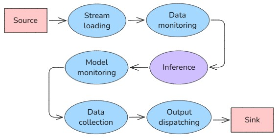
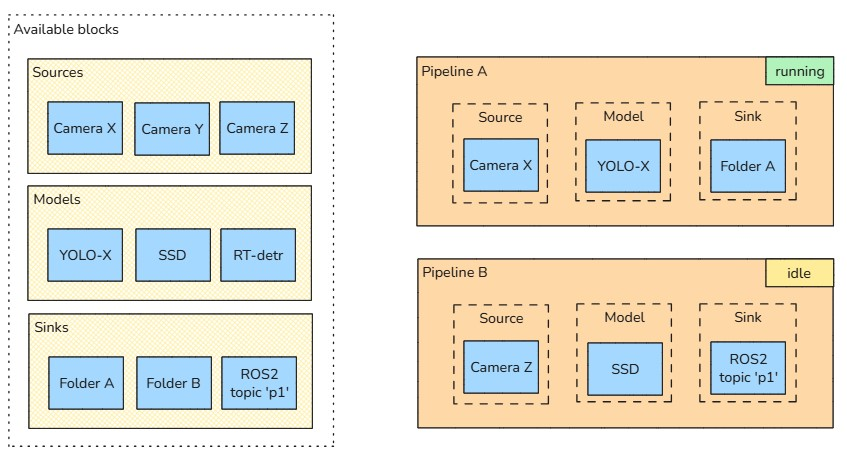

# Pipeline management

A pipeline consists of a series of stages that process a stream of data.



Within a pipeline we can identify three main elements:
- A _source_, namely the origin of the stream. This could be, for example, a camera or a video file. 
- A _model_, which elaborates the input data to generate predictions.
- A _sink_, that is where the results should be dispatched. This could be, for example, a folder or a message queue.

The _stream loading_, _inference_ and _output dispatching_ stages are indeed the core of the Geti Tune pipeline.  
There are also other stages too, such as model monitoring and data collection, which are not currently configurable.

Each stage outputs in a standard format, so it is possible to use any source in combination with any model and sink. 
A user can reconfigure a pipeline, for example switching to another camera for frame acquisition, or selecting a
different model to generate predictions. To make these operations easier, it is convenient to configure each 
source and sink independently, then choose which ones to enable in a pipeline. 

Furthermore, the ability to define multiple pipelines can be useful in various cases, for example to distinguish between
a production pipeline and an experimental one. In practice, a pipeline can be seen as a combination of source, 
sink and model, to be configured and activated as desired.



## Entities

### Sources

Supported sources include:
- cameras (webcams, industrial cameras, IP cameras, ...)
- files (videos, images)

The configuration of a source consists of a _type_ and a set of source-specific attributes. For example:
```yaml
type: video_file
video_path: videos/sports/golf.mp4
```
or
```yaml
type: ip_camera
stream_url: rtsp://192.168.1.100:554/stream
```

Each source is identified by a unique id, and optionally a friendly name chosen by the user (e.g. "Room 3 camera 4").

### Sinks

Supported sinks include:
- local filesystem (folder)
- Messaging frameworks (MQTT, ROS2, ...)

The configuration of a sink consists of a _type_ and a set of sink-specific attributes. For example:
```yaml
type: mqtt
broker_host: localhost
broker_port: 1883
topic: predictions
```

Each sink is identified by a unique id, and optionally a friendly name chosen by the user (e.g. "Robot 3").

### Models

Geti Tune supports models exported from Geti in OpenVINO IR format (.xml + .bin). All tasks are supported, including
classification, detection, segmentation, anomaly and keypoint detection.

A model is identified by a unique id, and optionally a friendly name chosen by the user (e.g. "YOLO-X car detector").

### Pipelines

A pipeline is a combination of a source, a model and a sink. These components can be replaced as needed.

The configuration of a pipeline looks like the following:
```yaml
source: <source_id>
model: <model_id>
sink: <sink_id>
```

A pipeline is identified by a unique id, and optionally a friendly name chosen by the user (e.g. "Production").

Users can export a pipeline to a zip file, so that they can later import it to another environment. 
The exported archive includes a full YAML definition of the source and sink. The user may decide to include the model
or not: if included, then the archive also contains the model binaries.

The status of a pipeline can be 'running' or 'idle'. A running pipeline constantly tries to load frames, process them
and output to the sink; conversely, an idle pipeline does not perform any work until activated. Multiple pipelines
may be running at the same time, provided that they don't share an _exclusive_ component: for example, two pipelines
configured to read from the same camera cannot run together. Exclusivity is a property of the source/sink type: e.g.
a physical camera requires exclusive access, whereas an IP camera or a topic does not.

## REST API

### Source configuration

| Method   | Path                       | Payload       | Return          | Description                       |
|----------|----------------------------|---------------|-----------------|-----------------------------------|
| `POST`   | `/api/sources`             | source config | source id       | Create and configure a new source |
| `GET`    | `/api/sources`             | -             | list of sources | List the available sources        |
| `GET`    | `/api/sources/<id>`        | -             | source info     | Get info about a source           |
| `PATCH`  | `/api/sources/<id>`        | source config | -               | Reconfigure an existing source    |
| `POST`   | `/api/sources/<id>:export` | -             | yaml file       | Export a source to file           |
| `POST`   | `/api/sources:import`      | yaml file     | source id       | Import a source from file         |
| `DELETE` | `/api/sources/<id>`        | -             | -               | Remove a source                   |

### Sink configuration

| Method   | Path                     | Payload     | Return        | Description                     |
|----------|--------------------------|-------------|---------------|---------------------------------|
| `POST`   | `/api/sinks`             | sink config | sink id       | Create and configure a new sink |
| `GET`    | `/api/sinks`             | -           | list of sinks | List the available sinks        |
| `GET`    | `/api/sinks/<id>`        | -           | sink info     | Get info about a sink           |
| `PATCH`  | `/api/sinks/<id>`        | sink config | -             | Reconfigure an existing sink    |
| `POST`   | `/api/sinks/<id>:export` | -           | yaml file     | Export a sink to file           |
| `POST`   | `/api/sinks:import`      | yaml file   | sink id       | Import a sink from file         |
| `DELETE` | `/api/sinks/<id>`        | -           | -             | Remove a sink                   |

### Model management

| Method    | Path               | Payload              | Return          | Description                          |
|-----------|--------------------|----------------------|-----------------|--------------------------------------|
| `POST`    | `/api/models`      | .xml, .bin, metadata | model id        | Upload a new model                   |
| `GET`     | `/api/models`      | -                    | list of models  | List the available models            |
| `GET`     | `/api/models/<id>` | -                    | model info      | Get info about a model               |
| `PATCH`   | `/api/models/<id>` | metadata             | -               | Update metadata of an existing model |
| `DELETE`  | `/api/models/<id>` | -                    | -               | Remove a model                       |

### Pipeline management

| Method   | Path                          | Payload                    | Return            | Description                         |
|----------|-------------------------------|----------------------------|-------------------|-------------------------------------|
| `POST`   | `/api/pipelines`              | ids of source, sink, model | pipeline id       | Create and configure a new pipeline |
| `GET`    | `/api/pipelines`              | -                          | list of pipelines | List the available pipelines        |
| `GET`    | `/api/pipelines/<id>`         | -                          | pipeline info     | Get info about a given pipeline     |
| `PATCH`  | `/api/pipelines/<id>`         | ids of source, sink, model | -                 | Reconfigure an existing pipeline    |
| `POST`   | `/api/pipelines/<id>:enable`  | -                          | -                 | Activate a pipeline                 |
| `POST`   | `/api/pipelines/<id>:disable` | -                          | -                 | Stop a pipeline                     |
| `POST`   | `/api/pipelines/<id>:export`  | -                          | zip               | Export a pipeline to file           |
| `POST`   | `/api/pipelines:import`       | zip                        | -                 | Import a pipeline from file         |
| `DELETE` | `/api/pipelines/<id>`         | -                          | -                 | Delete a pipeline                   |
